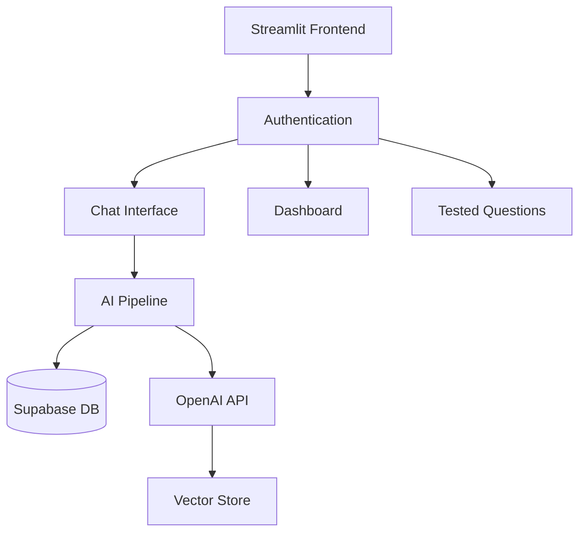
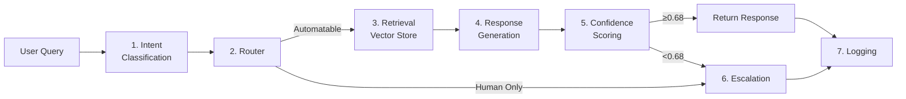
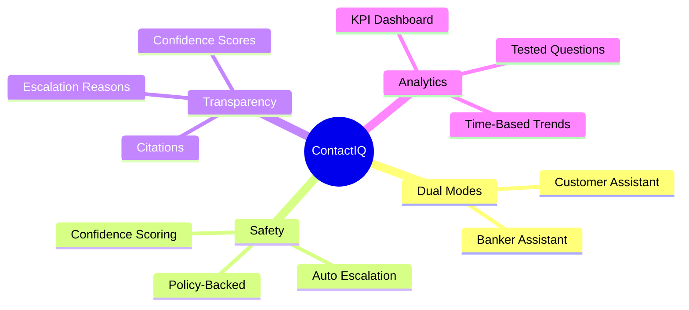
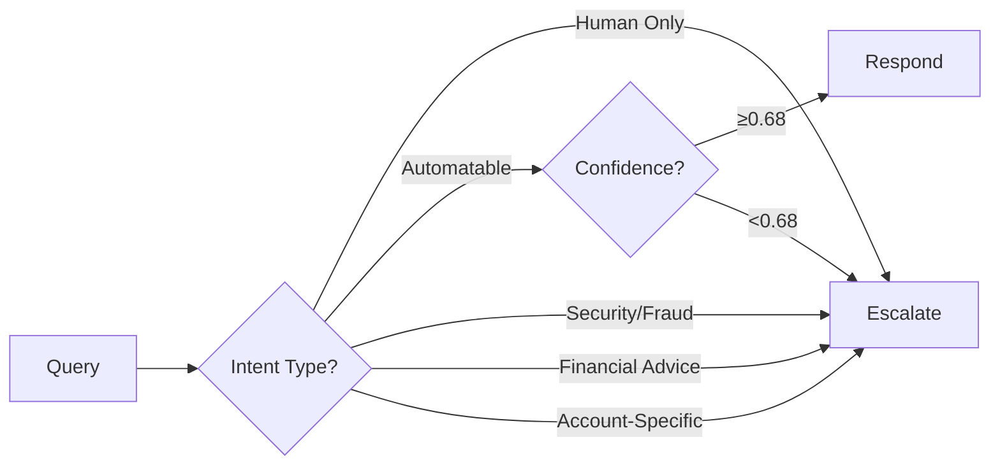

# ContactIQ 💬

**Conversational AI for Banking (MVP)**

A safe, transparent AI system for handling banking queries with policy-backed responses, confidence scoring, and automatic escalation.

---

## 🎯 Quick Start

```bash
git clone https://github.com/rahulsapre1/anz-conversational-ai-0.git
cd anz-conversational-ai-0
python3.12 -m venv venv
source venv/bin/activate
pip install -r requirements.txt
cp .env.example .env  # Fill in your keys
streamlit run main.py
```

**Deploy:** See [`QUICK_DEPLOY.md`](QUICK_DEPLOY.md) for Streamlit Cloud deployment (5 minutes)

---

## 🏗️ Architecture



---

## 🔄 Pipeline Flow



---

## 📊 Features



---

## 🛠️ Tech Stack

| Component | Technology |
|-----------|-----------|
| **Frontend** | Streamlit |
| **Backend** | Python 3.12+ (async/await) |
| **AI/ML** | OpenAI gpt-4o-mini, Vector Store |
| **Database** | Supabase PostgreSQL |
| **Logging** | structlog |

---

## 📁 Project Structure

```
anz-conversational-ai-0/
├── main.py              # Entry point
├── config.py            # Configuration
├── services/            # Pipeline services (async)
│   ├── intent_classifier.py
│   ├── router.py
│   ├── retrieval_service.py
│   ├── response_generator.py
│   ├── confidence_scorer.py
│   ├── escalation_handler.py
│   └── logger.py
├── ui/                  # Streamlit UI
│   ├── auth.py
│   ├── chat_interface.py
│   ├── dashboard.py
│   └── tested_questions.py
├── database/            # Supabase schema & client
├── knowledge/           # Vector Store setup
└── tests/               # Test suite (56 tests)
```

---

## ⚙️ Configuration

Required environment variables (`.env`):

```bash
OPENAI_API_KEY=sk-...
OPENAI_VECTOR_STORE_ID_CUSTOMER=vs_...
OPENAI_VECTOR_STORE_ID_BANKER=vs_...
SUPABASE_URL=https://xxx.supabase.co
SUPABASE_KEY=eyJ...
SESSION_PASSWORD=your-password
```

See [`SETUP_SUPABASE.md`](SETUP_SUPABASE.md) for database setup.

---

## 🧪 Testing

```bash
# Run all tests
pytest tests/

# With coverage
pytest --cov=services --cov=ui --cov-report=html tests/
```

**Test Coverage:** 56 tests covering all services, integration, auth, timeouts, and logging.

---

## 🚀 Deployment

### Streamlit Cloud (Recommended - Free)
1. Push code to GitHub
2. Go to [share.streamlit.io](https://share.streamlit.io)
3. Deploy and add secrets
4. **Done!** ⚡

See [`QUICK_DEPLOY.md`](QUICK_DEPLOY.md) for step-by-step guide.

### Render / Railway / Fly.io
- Use provided `Dockerfile`
- See [`DEPLOYMENT.md`](DEPLOYMENT.md) for details

---

## 📈 Safety & Escalation

The system escalates when:



**Escalation Triggers:**
- Intent category: `HumanOnly`
- Confidence score < `0.68`
- Security/fraud requests
- Account-specific queries
- Financial advice requests

---

## 📚 Documentation

- [`QUICK_DEPLOY.md`](QUICK_DEPLOY.md) - Fast deployment guide
- [`DEPLOYMENT.md`](DEPLOYMENT.md) - Complete deployment guide
- [`IMPLEMENTATION_GUIDE.md`](IMPLEMENTATION_GUIDE.md) - Implementation details
- [`PRD.md`](PRD.md) - Product Requirements Document
- [`guides/MASTER_INDEX.md`](guides/MASTER_INDEX.md) - Task guides index

---

## ⚠️ Safety Notice

**ContactIQ does not provide financial advice and always escalates when uncertainty exists.**

---

## 📝 License

[Your License Here]

---

## 🔗 Links

- **Repository:** https://github.com/rahulsapre1/anz-conversational-ai-0
- **Deploy:** https://share.streamlit.io (Streamlit Cloud)
